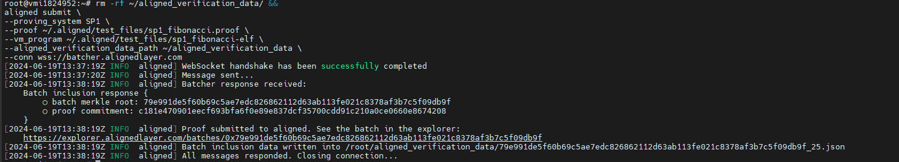

# Aligned Layer Proof


Herhangi bir sunucuda yapabilirsiniz. **Sürekli çalışacak bir şey değil proof aldığınızda işlem bitecek.** Kullandığım sunucu: **Ubuntu 22.04**



Gerekli yüklemeleri yapalım

```bash
sudo apt update -y && sudo apt upgrade -y
curl -L https://raw.githubusercontent.com/yetanotherco/aligned_layer/main/batcher/aligned/install_aligned.sh | bash
source /root/.bashrc
curl -L https://raw.githubusercontent.com/yetanotherco/aligned_layer/main/batcher/aligned/get_proof_test_files.sh | bash
```

Alttaki bloğu toplu girin

```bash
rm -rf ~/aligned_verification_data/ &&
aligned submit \
--proving_system SP1 \
--proof ~/.aligned/test_files/sp1_fibonacci.proof \
--vm_program ~/.aligned/test_files/sp1_fibonacci-elf \
--aligned_verification_data_path ~/aligned_verification_data \
--conn wss://batcher.alignedlayer.com
```

Alttaki gibi ⁠bir çıktı alacaksınız, linke tıklayın **Verified** olmasını bekleyin.

<figure><figcaption></figcaption></figure>


